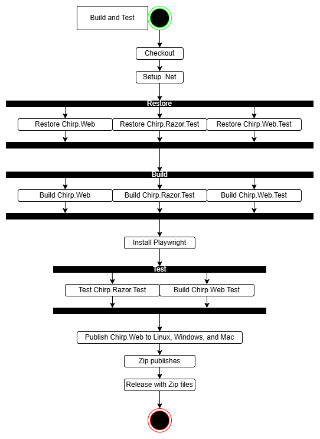
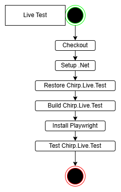
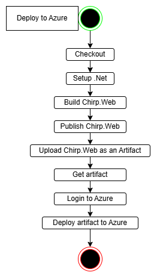
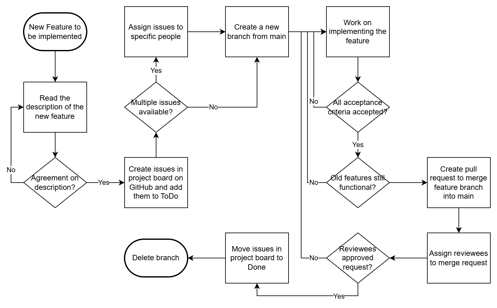
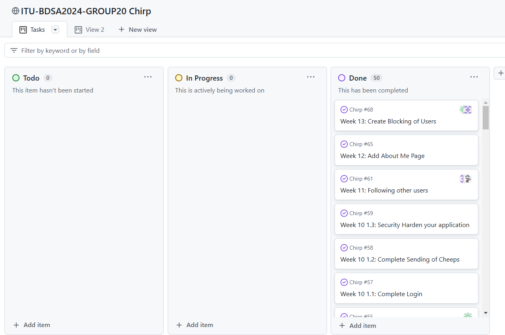

---
title: ___Chirp!___
subtitle: Group 20
author:
    - "Alexander <alefr@itu.dk>"
    - "Simon <simoh@itu.dk>"
    - "Sif <esja@itu.dk>"
    - "Radmehr<rads@itu.dk>"
numbersections: true
---


|                |                                            |
|----------------|--------------------------------------------|
| Course code    | BSANDSA1KU                                 |
| Name of course | Analysis, Design and Software Architecture |
| Course manager | Helge Pfeiffer - ropf@itu.dk               |
| Project title  | Chirp!                                     |
| Group number   | 20                                         |
| Date           | December 19 2024                           |
| School         | IT-University of Copenhagen                |

# Table of contents:
- [Table of contest](#table-of-contents)
- [Design and Architecture of Chirp!](#design-and-architecture-of-chirp)
    - [Domain model](#domain-model)
    - [Architecture — In the small](#architecture--in-the-small)
    - [Architecture of deployed application](#architecture-of-deployed-application)
      - [Client-server application](#client-server-application)
      - [Local client application](#local-client-application)
    - [User activities](#user-activities)
    - [Sequence of functionality/calls through Chirp!](#sequence-of-functionalitycalls-through-chirp)
- [Process](#process)
    - [Build, test, release, and deployment](#build-test-release-and-deployment)
    - [Team work](#team-work)
      - [Our Team work](#our-team-work)
    - [How to make Chirp! work locally](#how-to-make-chirp-work-locally)
        - [Web app](#web-app)
        - [How to run it Locally](#how-to-run-it-locally)
        - [How to run release](#how-to-run-release)
    - [How to run test suite locally](#how-to-run-test-suite-locally)
        - [Unit tests](#unit-tests)
        - [Integration and end-to-end tests](#integration-and-end-to-end-tests)
    - [Tests](#tests)
- [Ethics](#ethics)
    - [License](#license)
    - [LLMs, ChatGPT, CoPilot, and others](#llms-chatgpt-copilot-and-others)


# Design and Architecture of Chirp!

## Domain model

Our domain model for our application: Chirp. It is designed with the purpose to simulate 
‘Twitter’ or ‘X’ as it is called now. It consists of two parts, a Cheep class and an 
Author class that are closely tied.

The Cheep has some felts it stores all the information about a cheeps as example 
***CheepId***: there has a unique number, ***Text***: there store the actual message, 
but it has a limited on 160 characters, ***AuthorId/Author***: referencing to the 
other class Author so there comes a connection between all cheeps and Authors and 
then the last felt are ***TimeStamp***: to get the time the cheep are posted.

The Author has also some felts where it stores its information about a user’s as 
example ***Name***: there store the username there has a limited on 50 characters,
***Cheeps***: there store the cheeps in a collection from each author, ***Following***:
there store the other authors in a collection from each author(so there cheeps also 
get add to My Timeline), ***Blocking***: there store a collection of  authors there 
are hidden (so there cheeps are done invisible from the author). 
And then it extends *Microsoft.AspNetCore.Identity*. It also provides a hashed 
password and secures proper email verification.

<figure>
    
    <figcaption>UML class diagram of our domain model</figcaption>
</figure>

## Architecture — In the small

The diagram below illustrates our chirp program in Onion Architecture. The architecture
has three main layers:
- The inner layer - Chirp.Core:
  Contains our DTOs classes ***AuthorDTO*** and ***CheepDTO***
- The middle layer - Chirp.Infrastructure:
  Contains ***AuthorRepository***, ***CheepRepository*** and their interfaces as well as
  ***ChirpDBContext*** the database and our domain model, and it uses the Microsoft packed
  '*Microsoft.AspNetCore.Identity*'.
- The outer layer - Chirp.Web:
  Represents the web application as it contains ***Program*** as run the program, our
  ***DbInitializer*** aka our database and the folder ***Pages***, they are responsible for the
  layout, and it uses the Microsoft packed '*Microsoft.AspNetCore.Mvc.RazerPages*'.

<figure>
    
    <figcaption>Onion architecture of the Chirp application</figcaption>
</figure>

## Architecture of deployed application
### Client-server application
<figure>
     
    <figcaption>Architecture Illustration of our client-server application</figcaption>
</figure>

On the left side there are some clients in green (there can be a number of clients,
but we have only shown 2 clients) and they communicate with the internet. They are
interacting with web servers located on Microsoft Azure server. The web server
communicates to the database, as it needs to store or retrieve the data the client
should use, and then it gets sent back.

### Local client application
<figure>
     
    <figcaption>Architecture Illustration of our client-server application</figcaption>
</figure>

On the left side there are some clients in green (there can be a number of clients, 
but we have only shown 2 clients) and they communicate with the internet. They are 
interacting with web servers located on Microsoft Azure server. The web server 
communicates to the database, as it needs to store or retrieve the data the client 
should use, and then it gets sent back.


<figure>
     
    <figcaption>Architecture Illustration of our local client application</figcaption>
</figure>


On the left side there are our local clients. The client interacting with web server
There is a local server: localhost:5273. The server communicates 'mychirp.db',
as it needs to store or retrieve the data the client should use, and then it gets sent back.


## User activities


Here is a flowchart that illustrates the different paths there are in our program from the 
three ‘Login’ options ‘login with authorized user’, ‘login with GitHub’ or ‘login with 
non-registered user’.
After the log in process all the different things there can be done for example ‘writing a 
cheep’, ‘block a user’, ‘look at the “***About Me***” page’. And then you can end our user
journey with “***log out***” or click on the “***Forget me***” buttons.


<figure>
    
    <figcaption>Illustration of flowchart of a non-authorized user</figcaption>
</figure>

## Sequence of functionality/calls through Chirp!

<figure>
    
    <figcaption>UML sequence diagram from HTTP request to root endpoint</figcaption>
</figure>

The sequence diagram shown above shows a singular unauthorized user process for being 
shown the homepage when first finding the website.

Standard protocol when getting a site is requesting its HTTP version, which is not 
stable and can easily be compromised, which is why Chirp! then redirects to a HTTPS 
version and stores a cookie for the user, which makes the user always connect to the 
HTTPS version when requesting the site.

Afterward, Microsoft Identity attempts to check whether the user is authorized (logged 
in) or not. Due to this user being completely new and having no prior cookies, it is 
determined that they are unauthorized.

Then, the Chirp! homepage gets loaded, meaning the page has to get all available
cheeps that can be shown on one page, which is then sent to the user. 
They are now on a static page.

# Process
## Build, test, release, and deployment

| Build and Test                                                               | Live Test                                                                  | Deploy to Azure                                                                   |  
|------------------------------------------------------------------------------|----------------------------------------------------------------------------|-----------------------------------------------------------------------------------|  
|  |  |  |

Build and Test were made to create a release of the newest version-tagged build, as a compressed 
zip-file for Mac, Linux and Windows. It also runs through all unit tests and UI tests.

Live Test runs every 6 hours to check if our server is still alive and currently running.

Deploy to Azure is run whenever a build is version-tagged. It builds and then publishes it and 
sends it to Azures server to override the previous build.

Both Live Test and Deploy to Azure can also be activated via the GitHub actions interface, if 
deemed necessary. 
Build and Test can also be activated this way but will always fail.


## Team work


Whenever we were assigned a new feature, we made sure to properly understand the assignment and 
first then create an issue on our GitHub project board, which is placed in the ToDo section, 
with plenty of acceptance criteria. While we weren't entirely consistent in assigning issues 
to people in the team, we still tried to uphold it whenever possible.

At this point, we were ready to create a new branch and begin working on implementing the 
feature. Only after confirming that the implementation meets all acceptance criteria and does 
not impede previous features, we create a pull request to merge the branch into main.

Pull requests has to be peer-reviewed and accepted by other team members before it can be 
resolved, after which, the issues will be moved to the Done section of the project board and 
the feature branch will automatically be deleted.


Throughout the project we made a project board where we took the weekly assignment on 
‘README_PROJECT’ and thereafter made them into as small a task as we could. And we try to do 
it as structured as we could with naming them after the week they came from and the part of 
the week like “Week 9 1.1) …”. And with this structure we were about to keep up the workload 
done in an okay timeframe, so now all the tasks are in ‘Done’. But we were now super to assign 
the task on the board. 

Like there can be seen on the screenshot all from ‘Todo’ and ‘In Progress’ are moved to 
‘Done’. But in week 13 we made a listed over thing (a brainstorm of sorts) so we could add 
the most interesting things like ‘Block user’, ‘like cheep’, ‘Mobile friendly’, ‘comment on 
cheeps’, … But we did not add the things on the board, when we knew the change of, we could 
make all then in time was very slim. So, we added our main feature, ‘Block a user’ and then 
if someone got the time more could be added.


### Our team work
While we did initially start out as a team of five, during development the group did deteriorate 
a little bit. After a few weeks, Mathias dropped out of ITU, leaving us down to four people. 
When starting out, we gave Radmehr a decent bit of leeway in his productivity, however, during 
this entire semester, he has not contributed to the project nor report at all, except for a 
co-authored commit back on the 4th of September. This problem with Radmehr was brought up to our
TA during the second session.

## How to make Chirp! work locally

### Web-app
There is a runing version at this [link](https://bdsagroup20chirprazor-hdb4bch7ejb3abbd.northeurope-01.azurewebsites.net)

### How to run it Locally
In order to run Chirp there are 2 options
1. Make sure you have dotnet 8.0 installed see [download](https://dotnet.microsoft.com/en-us/download/dotnet/8.0)
2. Run this locally from a cloned repository
   - Clone the repository with this git command: ```git clone https://github.com/ITU-BDSA2024-GROUP20/Chirp.git```
   - Then go to the Chirp.Web directory with: ```cd .\src\Chirp.Web\```
   - Now run these commands inside the directory
     - ```dotnet user-secrets set "authentication_github_clientId" "Ov23liGbRbgORjmb9wUp"```
     -  ```dotnet user-secrets set "authentication_github_clientSecret" "0293ae8fdb1f1b046f42ab98234b11469648708e"```

3. You should now be able to run Chirp with:```dotnet run``` and access it at http://localhost:5273 when it is running

### How to run release
To run the release first go to the main page of the Repository and click on the release section.<br>
Find the latest version and download one of the following files depending on your operations system:
- Chirp-Win.zip, for Windows users
- Chirp-Mac.zip, for Mac users
- Chirp-Linux.zip , for Linux users<br>

When the file has been downloaded please unzip it.<br>
Then open a terminal and navigate to one of the following directories depending on your operations system:
- Chirp-Win\artifact\win, for windows
- Chirp-Mac\artifact\mac, for mac
- Chirp-Linux\artifact\linux, for linux<br>

Now run the following commands in the terminal:

- ```dotnet dev-certs https -t```
- ```./Chirp.Web  --urls="http://localhost:5273" --"authentication_github_clientId" "Ov23liGbRbgORjmb9wUp" --"authentication_github_clientSecret" "0293ae8fdb1f1b046f42ab98234b11469648708e" --development```

When running the application, and it is done starting up, a popup will appear in your terminal 
indicating which port it is running on "http://localhost:5273"

## How to run test suite locally
### Unit tests
To run the unit test for this program you will need to open a terminal and<br> navigate to 
the ```Chirp.Razor.Test``` directory which can be done from the root of the repository with:
```
cd .\test\Chirp.Razor.Test\ 
```
Now run ```dotnet test```

### Integration and end-to-end tests
Before running these tests, please delete the mychirp.db file in the ```\src\Chirp.Web``` 
directory and do the same when the tests are done running.

To run integration and end-to-end tests there are some prerequisites.<br>
To install Playwright, navigate to the root of Chirp, then run:
```
cd .\test\Chirp.Web.Test\ 
```
Build the program with:
```
dotnet build
```
Then run
```
pwsh bin/Debug/net8.0/playwright.ps1 install
```
Followed by
``` 
npx playwright install --with-deps
```
When Playwright is installed, open a separate terminal and navigate to the Chirp repository 
root and run:
``` 
cd .\src\Chirp.Web
```
And then run:
``` 
dotnet run
```
When the program is running, go to the terminal that is in ```.\test\Chirp.Web.Test``` 
and run the test with
``` 
dotnet test
```
Now, as the test are running you should see a browser popup where things are happening. That is 
the tests running.<br> 
At some point, a GitHub window may appear where it asks you to authorize, please press the 
button otherwise the test will fail.

### Tests
The unit test we have go over all the different functions we have in the Author Repository and 
Cheep Repository checking if they are working as intended.<br>

The integration tests go over all the different actions a user can take while on the web app 
and checks if the things that should show up when doing those actions are there.<br>

And the end-to-end test goes over all the different features in one go, like logging in, 
cheeping, following, blocking, and so on.

# Ethics
## License
We choose to use a MIT License since it allows others to download and change it however they 
want without restrictions.
## LLMs, ChatGPT, CoPilot, and others
During this project, we agreed that we would limit ourselves to use LLMs as little as possible. We used LLMs like
ChatGPT and Gemini when certain problems would arise that a normal search would not help. However, the code written
by them were never useful except as a hint at what direction to go with the actual code. We always ended up finding
the answer to our problem somewhere else. Therefore, we recommend not using LLMs for this type of project, as doing so
slowed down development.