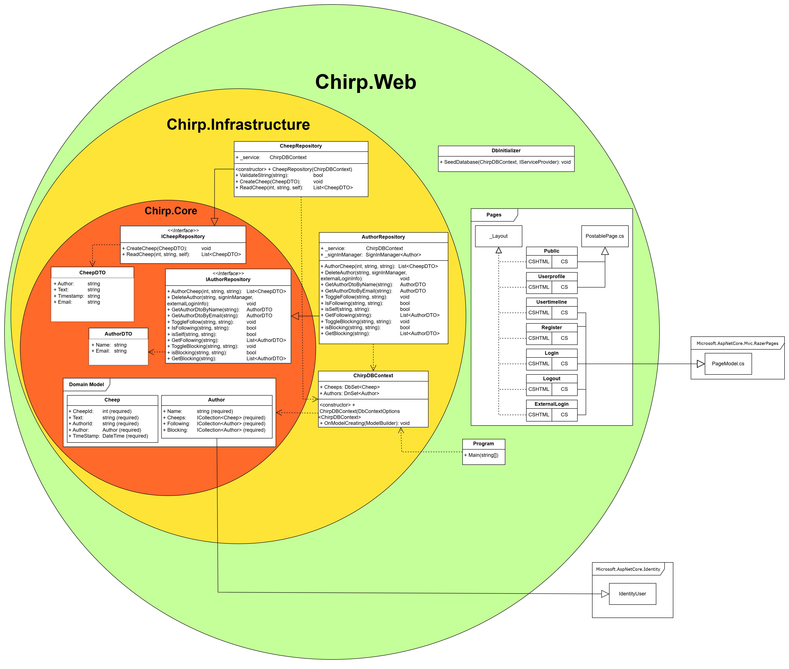
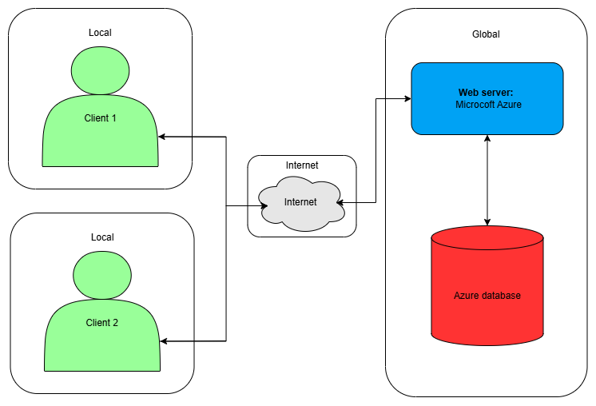
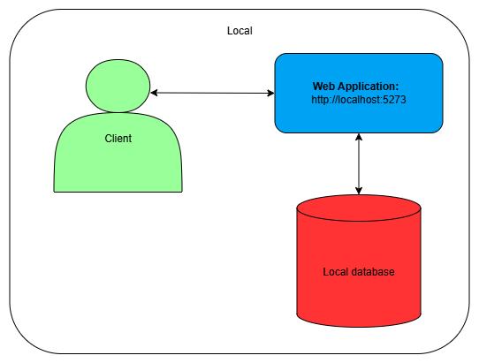

---
title: ___Chirp!___
subtitle: Group 20
author:
- "Alexander <alefr@itu.dk>"
- "Simon <simoh@itu.dk>"
- "Sif <esja@itu.dk>"
- "Radmehr<rads@itu.dk>"
numbersections: true
---

<style>
redColor { color: Red }
</style>


|                |                                            |
|----------------|--------------------------------------------|
| Course code    | BSANDSA1KU                                 |
| Name of course | Analysis, Design and Software Architecture |
| Course manager | Helge Pfeiffer - ropf@itu.dk               |
| Project title  | Chirp!                                     |
| Group number   | 20                                         |
| Date           | December 19 2024                           |
| School         | IT-University of Copenhagen                |

# Table of contents:
- [Table of contest](#table-of-contents)
- [Design and Architecture of Chirp!](#design-and-architecture-of-chirp)
    - [Domain model](#domain-model)
    - [Architecture — In the small](#architecture--in-the-small)
    - [Architecture of deployed application](#architecture-of-deployed-application)
    - [User activities](#user-activities)
    - [Sequence of functionality/calls through Chirp!](#sequence-of-functionalitycalls-through-chirp)
- [Process](#process)
    - [Build, test, release, and deployment](#build-test-release-and-deployment)
    - [Team work](#team-work)
    - [How to make Chirp! work locally](#how-to-make-chirp-work-locally)
        - [The Web-app](#the-web-app)
        - [How to run it Locally](#how-to-run-it-locally)
        - [How to run release](How to run release)
    - [How to run test suite locally](#how-to-run-test-suite-locally)
        - [Unit tests](#unit-tests)
        - [Integration and end-to-end tests](#integration-and-end-to-end-tests)
- [Ethics](#ethics)
    - [License](#license)
    - [LLMs, ChatGPT, CoPilot, and others](#llms-chatgpt-copilot-and-others)


# Design and Architecture of Chirp!

## Domain model
<redColo>Here comes a description of our domain model.
Illustration of the Chirp! data model as UML class diagram. </redColo>

<redColo>Provide an illustration of your domain model. Make sure that it is 
correct and complete. In case you are using ASP.NET Identity, make sure to 
illustrate that accordingly. </redColo>

Our domain model for our application: Chirp. It is design with the purpose to simulate 
‘Twitter’ or ‘X’ as it is call now. It consists of two parts, a Cheep class and an 
Author class there are closely tied.

The Cheep has some felts it stores all the information about a cheeps as example 
***CheepId***: there has a unique number, ***Text***: there store the actual message, 
but it has a limited on 160 characters, ***AuthorId/Author***: referencing to the 
other class Author so there comes a connection between all cheeps and Authors and 
then the last felt are ***TimeStamp***: to get the time the cheep are posted.

The Author has also some felts where it stores its information about a user’s as 
example ***Name***: there store the username there has a limited on 50 characters,
***Cheeps***: there store the cheeps in a collection from each author, ***Following***:
there store the other authors in a collection from each author(so there cheeps also 
get add to My Timeline), ***Blocking***: there store a collection of  authors there 
are hidden (so there cheeps are done invisible from the author). 
And then it extends *Microsoft.AspNetCore.Identity*. It also provides a hashed 
password and secures proper email verification.

<figure>
    
    <figcaption>UML class diagram of our domain model</figcaption>
</figure>

## Architecture — In the small
<redColo>Illustrate the organization of your code base. That is, illustrate 
which layers exist in your (onion) architecture. Make sure to illustrate which 
part of your code is residing in which layer.</redColo>

The diagram below illustrates our chirp program in Onion Architecture. The architecture
has three main layers:
- The inner layer - Chirp.Core:
  Contains our DTOs classes ***AuthorDTO*** and ***CheepDTO***
- The middle layer - Chirp.Infrastructure:
  Contains ***AuthorRepository***, ***CheepRepository*** and their interfaces as well as
  ***ChirpDBContext*** the database and our domain model, and it uses the Microsoft packed
  '*Microsoft.AspNetCore.Identity*'.
- The outer layer - Chirp.Web:
  Represents the web application as it contains ***Program*** as run the program, our
  ***DbInitializer*** aka our database and the folder ***Pages***, they are responsible for the
  layout, and it uses the Microsoft packed '*Microsoft.AspNetCore.Mvc.RazerPages*'.

<figure>
    
    <figcaption>Onion architecture of the Chirp application</figcaption>
</figure>

## Architecture of deployed application
<redColo>Illustrate the architecture of your deployed application. Remember, 
you developed a client-server application. Illustrate the server component and 
to where it is deployed, illustrate a client component, and show how these 
communicate with each other.</redColo>

<figure>
     
    <figcaption>Architecture Illustration of our client-server application</figcaption>
</figure>

On the left side there are some clients in green (there can be a number
of client, but we have only show 2 clients) and they communicate with
the internet. There so are interacting with web server there are
located on Microsoft Azure server. The web server communicates to the
database, as it needs to store or retrieve the data the client should use,
and then it gets send back.

<figure>
     
    <figcaption>Architecture Illustration of our local client application</figcaption>
</figure>

The diagram below are an illustrates of our local client architecture.

On the left side there are our local clients. The client interacting with web server 
there are local server: localhost:5273. The server communicates 'mychirp.db', 
as it needs to store or retrieve the data the client should use, and then it gets 
send back.

## User activities
<redColo>Illustrate typical scenarios of a user journey through your Chirp! 
application. That is, start illustrating the first page that is presented to a 
non-authorized user, illustrate what a non-authorized user can do with your 
Chirp! application, and finally illustrate what a user can do after 
authentication. </redColo>

<redColo>Make sure that the illustrations are in line with the actual behavior of 
your application.</redColo>

Here is a flowchart there illustrate the different path there are in our program from the 
three ‘Log in’ options ‘log in with authorized user’, ‘log in with GitHub’ or ‘log in with 
non-registered user’.
After the log in process all the different thing there can be done for example ‘writing a 
cheep’, ‘block a user’, ‘look at the “***About Me***” page’. And then you can end our user journey 
with “***log out***” or click on the “***Forget me***” buttons.


<figure>
    
    <figcaption>Illustration of flowchart of a non-authorized user</figcaption>
</figure>

## Sequence of functionality/calls through Chirp!
<redColo>With a UML sequence diagram, illustrate the flow of messages and data 
through your Chirp! application. Start with an HTTP request that is sent by an 
unauthorized user to the root endpoint of your application and end with the 
completely rendered web-page that is returned to the user.</redColo>

<redColo>Make sure that your illustration is complete. That is, likely for many of 
you there will be different kinds of "calls" and responses. Some HTTP calls 
and responses, some calls and responses in C# and likely some more. (Note 
the previous sentence is vague on purpose. I want you create a complete 
illustration.)</redColo>


<figure>
    
    <figcaption>UML sequence diagram from HTTP request to root endpoint</figcaption>
</figure>

The sequence diagram shown above shows a singular unauthorized user process for being 
shown the homepage when first finding the website.

Standard protocol when getting a site is requesting its HTTP version, which is not 
stable and can easily be compromised, which is why Chirp! then redirects to a HTTPS 
version and stores a cookie for the user, which makes the user always connect to the 
HTTPS version when requesting the site.

Afterward, Microsoft Identity attempts to check whether the user is authorized (logged 
in) or not. Due to this user being completely new and having no prior cookies, it is 
determined that they are unauthorized.

Then, the Chirp! homepage is gets loaded, meaning the page has to get all available 
cheeps that can be shown on one page, which is then sent to the user. They are now on a 
static page.

# Process
## Build, test, release, and deployment
<redColor>Illustrate with a UML activity diagram how your Chirp! applications are 
build, tested, released, and deployed. That is, illustrate the flow of activities 
in your respective GitHub Actions workflows.</redColor>

<figure>
  
  <figcaption></figcaption>
</figure>

<figure>
  
  <figcaption></figcaption>
</figure>

<figure>
  
  <figcaption></figcaption>
</figure>

<redColor>Describe the illustration briefly, i.e., how your application is built, 
tested, released, and deployed.</redColor>

## Team work
<redColor>Show a screenshot of your project board right before hand-in. Briefly 
describe which tasks are still unresolved, i.e., which features are missing 
from your applications or which functionality is incomplete.</redColor>

<redColor>Briefly describe and illustrate the flow of activities that happen from 
the new creation of an issue (task description), over development, etc. until a 
feature is finally merged into the main branch of your repository.</redColor>

## How to make Chirp! work locally
<redColo>There has to be some documentation on how to come from cloning your project 
to a running system. That is, Adrian or Helge have to know precisely what to 
do in which order. Likely, it is best to describe how we clone your project, 
which commands we have to execute, and what we are supposed to see then.</redColo>

### How to run the Web-app
There is a runing version at this [link](https://bdsagroup20chirprazor-hdb4bch7ejb3abbd.northeurope-01.azurewebsites.net)

### How to run it Locally
In order to run Chirp there are 2 options
1. Make sure you have dotnet 8.0 installed see [download](https://dotnet.microsoft.com/en-us/download/dotnet/8.0)
2. Run this locally from a cloned repository
   - Clone the repository with this git command: ```git clone https://github.com/ITU-BDSA2024-GROUP20/Chirp.git```
   - Then go to the Chirp.Web directory with: ```cd .\src\Chirp.Web\```
   - Now run these commands inside the directory
     - ```dotnet user-secrets set "authentication_github_clientId" "Ov23liGbRbgORjmb9wUp"```
     -  ```dotnet user-secrets set "authentication_github_clientSecret" "0293ae8fdb1f1b046f42ab98234b11469648708e"```

3. You should now be able to run Chirp with:```dotnet run``` and access it at http://localhost:5273 when it is running

### Release
To run the release first go to the main page of the Repository and click on the release section.<br>
Find the latest version and download one of the following files depending on your operations system:
- Chirp-Win.zip, for Windows users
- Chirp-Mac.zip, for Mac users
- Chirp-Linux.zip , for Linux users<br>

When the file has been downloaded please unzip it.<br>
Then open a terminal and navigate to one of the following directories depending on your operations system:
- Chirp-Win\artifact\win, for windows
- Chirp-Mac\artifact\mac, for mac
- Chirp-Linux\artifact\linux, for linux<br>

Now run the following commands in the terminal:

- ```dotnet dev-certs https -t```
- ```./Chirp.Web  --urls="http://localhost:5273" --"authentication_github_clientId" "Ov23liGbRbgORjmb9wUp" --"authentication_github_clientSecret" "0293ae8fdb1f1b046f42ab98234b11469648708e" --development```

When running the application, and it is done starting up, a popup will appear in your terminal indicating which port it is running on "http://localhost:5273"

## How to run test suite locally
<redColo>List all necessary steps that Adrian or Helge have to perform to execute 
your test suites. Here, you can assume that we already cloned your repository in 
the step above.</redColo>

<redColo>Briefly describe what kinds of tests you have in your test suites and what 
they are testing.</redColo>

### Unit tests
To run the unit test for this program you will need to open a terminal and<br> navigate to the ```Chirp.Razor.Test``` directory which can be done from the root of the repository with:
```
cd .\test\Chirp.Razor.Test\ 
```
Now run ```dotnet test```

### Integration and end-to-end tests
Before runing these tests, please delete the mychirp.db file in the ```\src\Chirp.Web``` directory and do the same when the tests are done running.

To run integration and end-to-end tests there are some pre-requisites.<br>
To install Playwright, navigate to the root of Chirp, then run:
```
cd .\test\Chirp.Web.Test\ 
```
Build the program with:
```
dotnet build
```
Then run
```
pwsh bin/Debug/net8.0/playwright.ps1 install
```
Followed by
``` 
npx playwright install --with-deps
```
When Playwright is installed, open a separate terminal and navigate to the Chirp repository root and run:
``` 
cd .\src\Chirp.Web
```
And then run:
``` 
dotnet run
```
When the program is running, go to the terminal that is in ```.\test\Chirp.Web.Test``` and run the test with
``` 
dotnet test
```
Now, as the test are running you should see a browser popup where things are happening. That is the tests running.<br>
At some point, a GitHub window may appear where it asks you to authorize, please press the button otherwise the test will fail.

# Ethics
## License
<redColor>State which software license you chose for your application.</redColor>
## LLMs, ChatGPT, CoPilot, and others
<redColor>State which LLM(s) were used during development of your project. In case 
you were not using any, just state so. In case you were using an LLM to support 
your development, briefly describe when and how it was applied. Reflect in 
writing to which degree the responses of the LLM were helpful. Discuss 
briefly if application of LLMs sped up your development or if the contrary 
was the case.</redColor>


