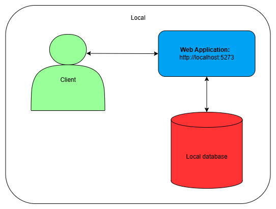

https://www.markdownguide.org/cheat-sheet/

# Design and Architecture of Chirp!

## Domain model
<redColor>Here comes a description of our domain model.
Illustration of the Chirp! data model as UML class diagram. </redColor>

<redColor>Provide an illustration of your domain model. Make sure that it is 
correct and complete. In case you are using ASP.NET Identity, make sure to 
illustrate that accordingly. </redColor>

Our domain model for our application: Chirp. It is design with the purpose to simulate 
‘Twitter’ or ‘X’ as it is call now. It consists of a two parts, a Cheep class and an 
Author class there are closely tied.

The Cheep has some felts it stores all the information about a cheeps as example 
***CheepId***: there has a unique number, ***Text***: there store the actual message 
but it has a limited on 160 characters, ***AuthorId/Author***: referencing to the 
other class Author so there comes a connection between all cheeps and Authors and 
then the last felt are ***TimeStamp***: to get the time the cheep are posted.

The Author has also some felts where it stores its information about a user’s as 
example ***Name***: there store the username there has a limited on 50 characters,
***Cheeps***: there store the cheeps in an collection from each author, ***Following***:
there store the other authors in a collection from each author(so there cheeps also 
get add to My Timeline), ***Blocking***: there store a collection of  authors there 
are hidden (so there cheeps are done invisible from the author. 
And then it extends *Microsoft.AspNetCore.Identity*. And it provides hashed a the 
passwords and email verification.

## Architecture — In the small
<redColor>Illustrate the organization of your code base. That is, illustrate 
which layers exist in your (onion) architecture. Make sure to illustrate which 
part of your code is residing in which layer.</redColor>

## Architecture of deployed application
<redColor>Illustrate the architecture of your deployed application. Remember, 
you developed a client-server application. Illustrate the server component and 
to where it is deployed, illustrate a client component, and show how these 
communicate with each other.</redColor>

 

 

## User activities
<redColor>Illustrate typical scenarios of a user journey through your Chirp! 
application. That is, start illustrating the first page that is presented to a 
non-authorized user, illustrate what a non-authorized user can do with your 
Chirp! application, and finally illustrate what a user can do after 
authentication. </redColor>

<redColor>Make sure that the illustrations are in line with the actual behavior of 
your application.</redColor>

## Sequence of functionality/calls through Chirp!
<redColor>With a UML sequence diagram, illustrate the flow of messages and data 
through your Chirp! application. Start with an HTTP request that is sent by an 
unauthorized user to the root endpoint of your application and end with the 
completely rendered web-page that is returned to the user.</redColor>

<redColor>Make sure that your illustration is complete. That is, likely for many of 
you there will be different kinds of "calls" and responses. Some HTTP calls 
and responses, some calls and responses in C# and likely some more. (Note 
the previous sentence is vague on purpose. I want you create a complete 
illustration.)</redColor>

# Process
## Build, test, release, and deployment
<redColor>Illustrate with a UML activity diagram how your Chirp! applications are 
build, tested, released, and deployed. That is, illustrate the flow of activities 
in your respective GitHub Actions workflows.</redColor>

<redColor>Describe the illustration briefly, i.e., how your application is built, 
tested, released, and deployed.</redColor>

## Team work
<redColor>Show a screenshot of your project board right before hand-in. Briefly 
describe which tasks are still unresolved, i.e., which features are missing 
from your applications or which functionality is incomplete.</redColor>

<redColor>Briefly describe and illustrate the flow of activities that happen from 
the new creation of an issue (task description), over development, etc. until a 
feature is finally merged into the main branch of your repository.</redColor>

## How to make Chirp! work locally
<redColor>There has to be some documentation on how to come from cloning your project 
to a running system. That is, Adrian or Helge have to know precisely what to 
do in which order. Likely, it is best to describe how we clone your project, 
which commands we have to execute, and what we are supposed to see then.</redColor>

## How to run test suite locally
<redColor>List all necessary steps that Adrian or Helge have to perform to execute 
your test suites. Here, you can assume that we already cloned your repository in 
the step above.</redColor>

<redColor>Briefly describe what kinds of tests you have in your test suites and what 
they are testing.</redColor>

# Ethics
# License
<redColor>State which software license you chose for your application.</redColor>
# LLMs, ChatGPT, CoPilot, and others
<redColor>State which LLM(s) were used during development of your project. In case 
you were not using any, just state so. In case you were using an LLM to support 
your development, briefly describe when and how it was applied. Reflect in 
writing to which degree the responses of the LLM were helpful. Discuss 
briefly if application of LLMs sped up your development or if the contrary 
was the case.</redColor>

